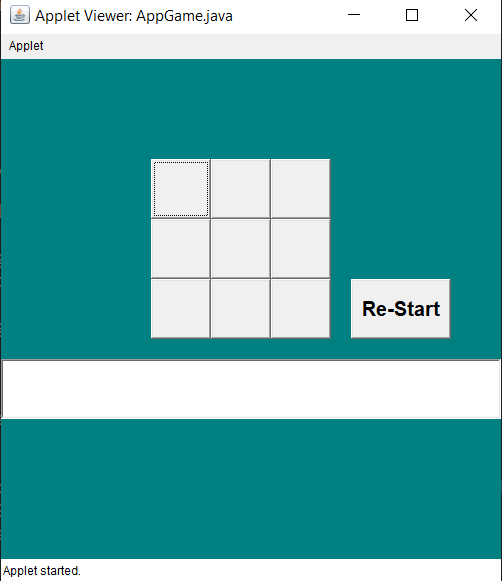
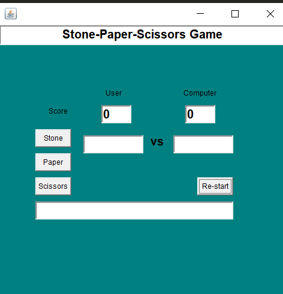

# Game

This repository contains Some **small games** using java applet.

## 1. Matchsticks

Using the below comment you will run this code.
```
> Using any C or Cpp compiler you will run this code . Example: Using Turbo C++
```

### RULES:
```
1.THERE ARE 21 MATCH STICK INITIALLY
2.THE GAME BETWEEN USER AND COMPUTER
3.FIRST USER TAKE MATCH STICK COUNT OF 1 TO 4
4.WHO TAKE LAST MATCH STICK IS LOSSER
```


## 2. Tic-Tac-Toe

Using the below comment you will run this code.

```
> For compile : javac AppGame.java

> For Run : appletviewer AppGame.java

Use java version 7 or 8 
```


### Rules
```
1. This game is between two users
2. The first user is X and second user is O
3. Regular rules of XO
```




## 3. Stone-Paper-scissor

Using the below comment you will run this code.

```
> For compile : javac Game.java

> For Run : java Game

Use java version 7 or 8 
```

### Rules
```
1. This game is between user and computer
2.  i)   Stone vs paper   --> paper wins
    ii)  Stone vs scissor --> stonewins
    iii) paper vs scissor --> scissor wins
3. Based on the above situation winner will be decide
```

